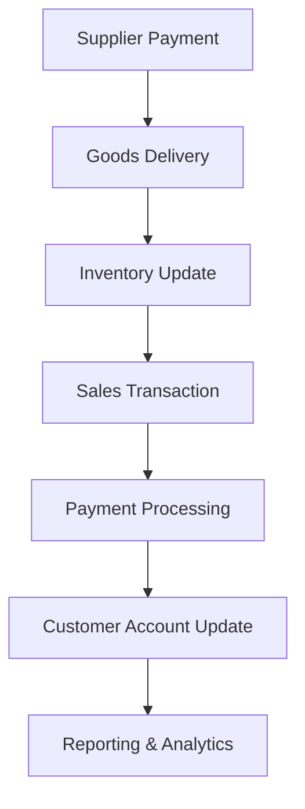

# Retail Management System v1

> **This is the legacy version - [Check out v2.0](link-to-v2-repo) for the latest improvements**

A comprehensive retail management system designed specifically for motorcycle and spare parts retail businesses. This system handles the complete business workflow from supplier payments and inventory management to customer sales and loan tracking.

## 🏢 Business Overview

This system was built to solve real-world challenges faced by motorcycle retail businesses, including:

- **Dynamic supplier relationships** with flexible payment and delivery schedules
- **inventory states**
- **Multiple payment methods** for sales transactions
- **Customer financial services** (deposits, loans, installments)
- **Comprehensive reporting** across all business activities

## 📋 Core Features

### 🛒 **Supply Chain Management**
- **Flexible Payment System**: Make payments to suppliers with dynamic delivery schedules
- **Batch Delivery Tracking**: Handle partial deliveries across multiple shipments
- **Delivery Status Monitoring**: Track expected vs delivered quantities

### 📦 **Inventory Management** 
- **Product Information Storage**: Comprehensive goods catalog
- **Automatic Stock Updates**: Real-time inventory adjustments from deliveries and sales

### 💰 **Sales Management**
- **Multiple Sale Types**: 
  - Individual sales (with engine/chassis numbers for coupled motorcycles)
  - Bulk sales (boxed motorcycles and spare parts)
- **Flexible Payment Methods**:
  - Cash payments
  - Bank transfers  
  - Customer deposit balance
  - Credit sales (loans)
  - Installment plans

### 👥 **Customer Management**
- **Customer Profiles**: Complete customer information storage
- **Deposit System**: Customer savings and purchase deposits
- **Withdrawal Processing**: Flexible deposit withdrawal system
- **Activity Tracking**: Complete customer transaction history

### 🏦 **Loan & Credit System**
- **Multiple Loan Types**:
  - Standard cash loans
  - Sales loans (goods sold on credit)
  - Installment sales (spread payments over time)
- **Repayment Tracking**: Monitor loan balances and payment schedules
- **Credit Sales Integration**: Seamless integration with sales system

### 📊 **Reporting & Analytics**
- **KPI Dashboard**: Key performance indicators and business metrics
- **Time-based Reports**: Daily, weekly, monthly, and yearly reports
- **Activity Reports**: Comprehensive business activity summaries
- **Print-ready Formats**: Professional report printing capabilities

## 🖼️ Screenshots

### Dashboard Overview


Main dashboard showing business KPIs and recent activities

### Sales Management

Sales recording interface with multiple payment options

### Inventory Tracking

Inventory management with status tracking

### Supplier Management

Supplier payment and delivery tracking

### Customer Management

Customer financial activities

### Reports Interface

Comprehensive reporting system

## 🛠️ Installation

### Prerequisites
- Python 3.8+
- Django 5.0+
- SQLite

### Setup Instructions

```bash
# Clone the repository
git clone https://github.com/sanusi-dev/Retail-management-system-v1.git
cd Retail-management-system-v1

# Create virtual environment
python -m venv venv
source venv/bin/activate  # On Windows: venv\Scripts\activate

# Install dependencies
pip install -r requirements.txt

# Run migrations
python manage.py makemigrations
python manage.py migrate

# Create superuser
python manage.py createsuperuser

# Start development server
python manage.py runserver
```

## 💼 User Roles & Capabilities

### Administrator
- **System Access**: Full login/logout functionality
- **Dashboard Access**: Business overview and KPI monitoring
- **Sales Recording**: All sale types tracking
- **Supplier Management**: Payment recording and delivery tracking
- **Customer Services**: Deposits, withdrawals, loans, and repayments
- **Data Management**: Add products, customers, and suppliers
- **Error Correction**: Reverse erroneous transactions
- **Reporting**: Generate and print business reports

## 🏗️ System Architecture

### Single App Structure
This v1 implementation uses a monolithic Django app structure with all functionalities contained within a single application module.

### Key Models
- **Products**: Goods catalog with model specifications
- **Suppliers**: Vendor information and relationship tracking
- **Customers**: Customer profiles and activity history
- **Sales**: Transaction records with payment method tracking
- **Inventory**: Stock levels and status management
- **Payments**: Supplier payment tracking
- **Deliveries**: Goods delivery management
- **Loans**: Credit and installment tracking

## 📈 Business Workflow



## 🚀 Getting Started

1. **Initial Setup**: Follow installation instructions above
2. **Add Suppliers**: Register your business suppliers
3. **Add Products**: Create your goods catalog
4. **Record Payments**: Start with supplier payments
5. **Track Deliveries**: Monitor incoming inventory
6. **Process Sales**: Begin recording customer transactions
7. **Monitor Dashboard**: Use KPI dashboard for business insights
